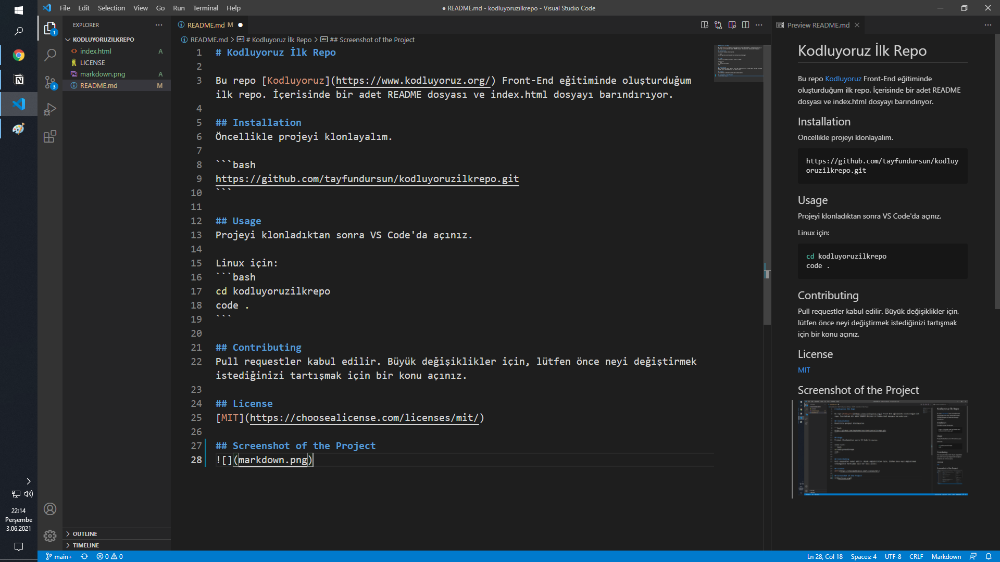

# Kodluyoruz İlk Repo

Bu repo [Kodluyoruz](https://www.kodluyoruz.org/) Front-End eğitiminde oluşturduğum ilk repo. İçerisinde bir adet README dosyası ve index.html dosyayı barındırıyor.

## Installation
Öncellikle projeyi klonlayalım.   

```bash
https://github.com/tayfundursun/kodluyoruzilkrepo.git
```

## Usage    
Projeyi klonladıktan sonra VS Code'da açınız.

Linux için:   
```bash
cd kodluyoruzilkrepo
code .
```

## Contributing
Pull requestler kabul edilir. Büyük değişiklikler için, lütfen önce neyi değiştirmek istediğinizi tartışmak için bir konu açınız.

## License
[MIT](https://choosealicense.com/licenses/mit/)

## Screenshot of the Project
